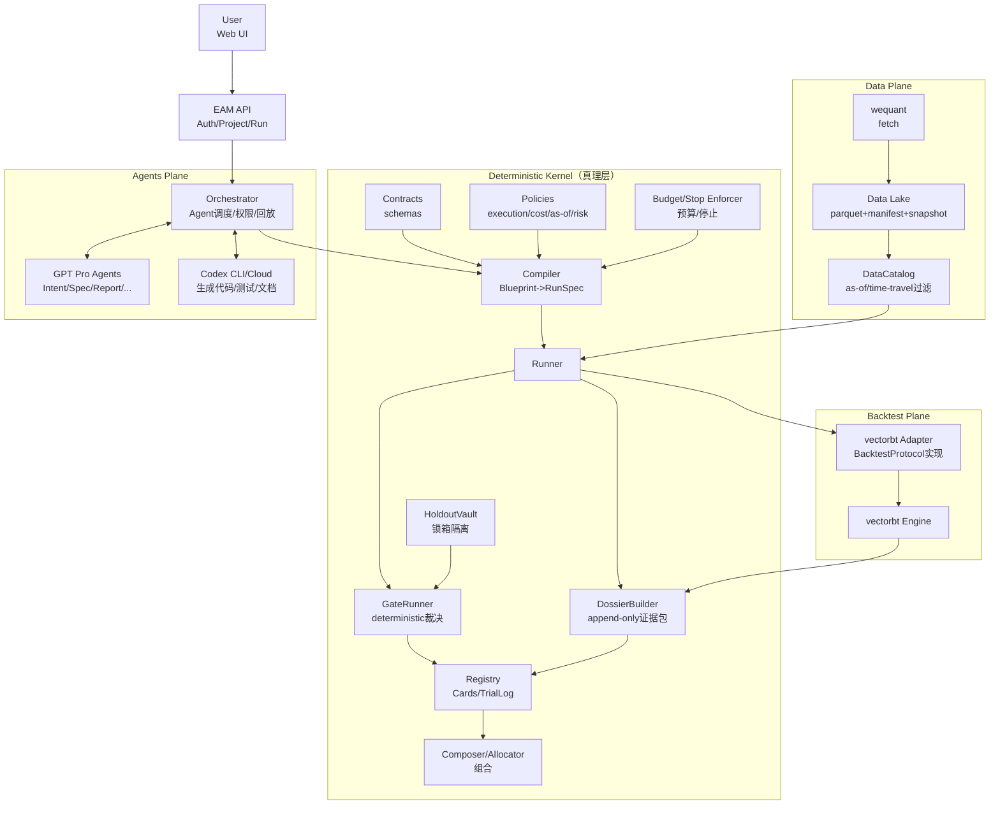
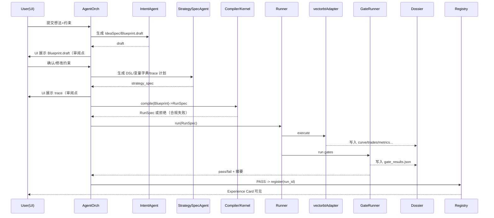
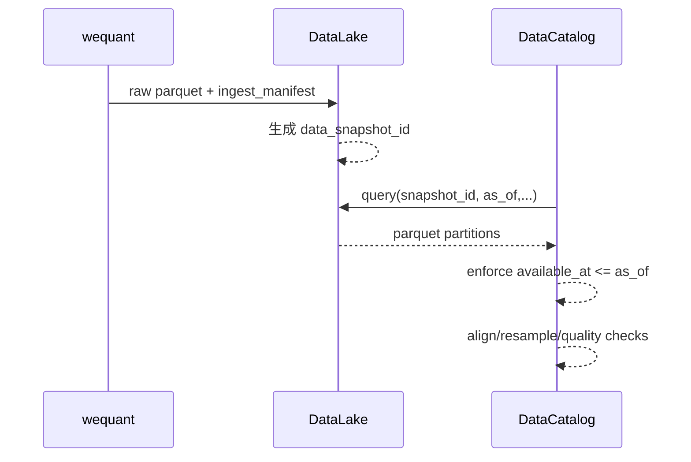

# Quant‑EAM 架构文档（wequant + vectorbt 版）v0.3（评审草案）

- 日期：2026‑02‑09（Asia/Taipei）
- 面向：系统评审 / 施工拆解 / Codex 任务编排
- 已有资产：**wequant（取数）**、**vectorbt（回测引擎）**
- 待建设：Kernel（Contracts/Policies/Compiler/Gates/Dossier/Registry/Holdout/Budget）、UI、Agents、Docs、CI/CD、可观测性

---

## 1. 背景与目标

### 1.1 你要构建的不是“策略工厂”，而是“可审计的经验资产系统”
系统目标是：把策略想法固化为可编译规格（Blueprint/DSL），通过确定性 Gate 裁决，形成证据包（Dossier）与经验卡（Experience Card），最终可组合、可复评、可治理。

### 1.2 范围（Scope）
**本架构文档覆盖：**
- wequant → Data Lake → DataCatalog 的数据统一接口与 time‑travel（as_of / available_at）
- vectorbt 作为第一版回测引擎的 BacktestAdapter 与统一回测协议（RunSpec）
- 确定性 Kernel：Contracts/Policies/Compiler/Runner/GateRunner/DossierBuilder/Registry/Holdout/Budget
- LLM 多 Agent 的职责边界与“可执行 harness”工程规范
- Web UI 对全流程的覆盖边界与信息架构
- 施工里程碑与验收标准（DoD）

**不在本架构里承诺：**
- 高频逐笔撮合的真实交易级微观结构（可作为后续 adapter）
- LLM 在线自动下单（不做）
- 回测时现场检索文档再询问模型（禁止，泄漏风险高）

---

## 2. 系统原则（硬约束：写入 GOVERNANCE.md + CI 强制）

> 以下约束应作为“系统真理”，任何 agent/工具不能绕过。

1) **Execution / Cost / As‑of Policy 只读**
- 策略/模块只能引用 `policy_id`，禁止覆盖或内联修改。

2) **策略生成只能生成 Blueprint/DSL**
- 禁止绕开编译器写“策略脚本”直接跑回测。

3) **裁判只允许 Gate + Dossier**
- PASS/FAIL/晋升必须引用证据包产物；纯文本意见无效。

4) **锁箱（Final Holdout）不可污染**
- 生成/调参循环不得获得锁箱细节，只能得到 `pass/fail + 极少摘要`。

5) **模块必须有单元测试**
- 至少覆盖：lookahead/对齐/NaN/索引单调性。

6) **实验预算与停止条件强制**
- 每轮候选数上限、连续无提升停止，避免无限搜索挖假阳性。

---

## 3. 总体架构（组件图）

### 3.1 C4 Level‑1：平面划分
- **Data Plane**：wequant、Data Lake、DataCatalog（time‑travel）
- **Backtest Plane**：vectorbt（引擎）+ vectorbt adapter（协议翻译）
- **Deterministic Kernel**：Contracts/Policies/Compiler/Runner/Gates/Dossier/Registry/Holdout/Budget
- **Agents Plane**：GPT Pro Agents + Codex CLI/Cloud（只生产候选与解释）
- **UI Plane**：端到端审阅与可视化（不要求用户看源码）

### 3.2 架构图（Mermaid）



> 核心：**Kernel 负责真理与裁决；Agents 负责生成与解释；UI 负责审阅与决策。**

---

## 4. 核心对象模型（系统只认这些）

### 4.1 IdeaSpec（意图规格）
用于把自然语言结构化，方便编译与回放。

**字段建议：**
- `asset_pack` / `symbols` / `universe`
- `frequency`（1d/1h/…）
- `holding_horizon`
- `constraints`（换手上限、杠杆、成本敏感、容量约束）
- `paradigm_hint`：`vector_signal`（首版）、未来可扩展 `event_driven`、`portfolio`、`rl`
- `evaluation_intent`：walk-forward、stress、holdout 等

### 4.2 Blueprint（策略蓝图：可编译规格）
Blueprint 是“策略的合规表达”，必须可静态分析。

**字段建议：**
- `policy_bundle_id`（只读引用：execution/cost/as-of/risk）
- `data_requirements`（字段/频率/可得性/延迟假设）
- `strategy_spec`（DSL 或模块组合）
- `engine_contract`（选择回测协议：vectorbt_signal_v1）
- `evaluation_protocol`（train/test/holdout 分段、purge/embargo）
- `report_spec`（UI 需生成的图/表/trace）

### 4.3 RunSpec（运行规格：Compiler 输出）
RunSpec 由 Compiler 生成，明确“这次运行到底怎么跑”。

**字段建议：**
- `blueprint_hash`
- `data_snapshot_id`
- `policy_bundle_id`
- `segments`: train/test/holdout（含 as_of）
- `param_grid` / `seeds` / `budget`
- `adapter`: `vectorbt_signal_v1`
- `output_spec`: dossier 产物清单

### 4.4 Dossier（证据包：append‑only）
Dossier 是系统唯一事实来源（UI 的内容源）。

**目录建议：**
```
dossiers/<run_id>/
  config_snapshot.json
  data_manifest.json
  metrics.json
  curve.csv
  trades.csv
  positions.csv
  exposures.csv
  cost_breakdown.csv
  gate_results.json
  calc_trace/...
  reports/
    report.md
    report.html
  logs/...
```

### 4.5 GateResults（确定性裁决）
`gate_results.json`：逐项 Gate 的 pass/fail、指标、阈值、失败原因、版本号。

### 4.6 Experience Card（经验卡）
记录：适用条件、失效模式、敏感性、证据引用（run_id）与状态（draft/challenger/champion/retired）。

---

## 5. 模块设计（职责 / 输入输出 / 是否确定性）

### 5.1 Data Plane

#### M1. wequant Adapter（已有 → 需要标准化包装）
- **职责**：统一 wequant 的拉取方式为可重复调用的 fetch 接口；产出 ingest manifest。
- **输入**：dataset/symbols/range/freq/fields
- **输出**：raw parquet + `ingest_manifest.json`

> 如果 wequant 无法提供真实 `available_at`，必须在 Policies 中定义“延迟口径”并生成 `available_at = event_time + latency_policy`。

#### M2. Data Lake（需要新增，建议做“wesu‑lite”）
- **职责**：落地 raw/curated 数据、元数据、快照版本（snapshot_id）。
- **实现建议**：
  - parquet 分区：`dataset/freq/symbol/dt=YYYY-MM-DD/part-*.parquet`
  - 元数据：sqlite/postgres（datasets、schema_version、snapshot、manifest）
- **输出**：`data_snapshot_id`（复现关键）

#### M3. DataCatalog（必须 deterministic）
- **职责**：time‑travel 查询；强制 `available_at <= as_of` 过滤；输出标准 bars/feature frame。
- **输入**：query + `as_of` + `data_snapshot_id`
- **输出**：对齐后的 df/ndarray + metadata（coverage/na/延迟统计）

---

### 5.2 Backtest Plane（vectorbt）

#### M4. vectorbt Adapter（deterministic）
- **职责**：把 RunSpec 翻译成 vectorbt 的输入（价格/信号/权重/订单矩阵）并运行。
- **输入**：RunSpec + DataCatalog 输出 + Policies
- **输出**：trades/curve/stats/positions/exposures/cost（写入 Dossier）

> 首版建议以 `signal -> portfolio` 的向量化范式为主：entry/exit、持仓、止损止盈等。

---

### 5.3 Deterministic Kernel

#### M5. Contracts（schemas）
- **职责**：定义并校验：data_contract、blueprint_schema、run_spec_schema、dossier_schema。
- **实现建议**：JSON Schema + pydantic 校验；CI 强制。

#### M6. Policies（冻结）
- **职责**：冻结 execution/cost/as_of/risk/gate_suite；策略只能引用。
- **实现建议**：YAML；CodeOwners + CI 禁止直接改动。

#### M7. Compiler（Blueprint -> RunSpec）
- **职责**：
  - schema 校验
  - policy 锁定检查（禁止覆盖）
  - as_of 合规检查（数据可得性）
  - 预算/停止条件注入
- **输出**：RunSpec.json

#### M8. Runner（执行）
- **职责**：调用 BacktestAdapter 运行，产出 Dossier（不做裁决）。
- **输出**：run_id + dossier_path

#### M9. GateRunner（裁判）
- **职责**：读取 Dossier 产物，执行 gate_suite（确定性），写 gate_results.json。
- **最小 Gate（v1）**：
  - no‑lookahead（对齐与可得性）
  - delay +1bar 压测
  - cost ×2 压测
  - 参数扰动（鲁棒性）
  - 锁箱（holdout pass/fail + 极少摘要）

#### M10. HoldoutVault（锁箱隔离）
- **职责**：锁箱数据与结果对 Agents/UI 的访问策略（只允许脱敏摘要）。

#### M11. DossierBuilder（证据包与报告）
- **职责**：将回测与 gate 产物固化、生成图表与报告（HTML/MD/PDF）。
- **注意**：报告文本可由 LLM 协助生成，但必须引用具体 artifacts 路径/字段，防“幻觉解释”。

#### M12. Registry（经验库）
- **职责**：TrialLog（所有实验记录）、Experience Cards（入库/状态机）、Scoreboard（可选）。
- **准入**：必须引用 Gate PASS 的 run_id。

#### M13. Budget/Stop Enforcer
- **职责**：强制候选数上限、参数搜索上限、连续无提升停止；防“无限搜索”。

---

### 5.4 Agents Plane（GPT Pro + Codex）

#### 工程标准：每个 Agent 必须是“可执行 harness”
每个 agent 目录结构建议：
```
agents/<agent_name>/
  run.py                # 输入JSON -> 输出JSON/MD
  prompt.md             # 规则、禁止项、输出格式
  io_schema.json        # I/O schema
  tests/                # 输出schema测试 + 快照测试
```

#### 最小闭环 Agents（推荐先落地这 4 个）
1) **Intent Agent**
- In：用户一句话 + 约束
- Out：IdeaSpec + Blueprint.draft

2) **StrategySpec Agent**
- In：Blueprint.draft
- Out：Strategy DSL + 变量字典 + calc_trace 计划  
> 关键：输出应面向 UI 审阅，不要求用户看源码。

3) **Report Agent**
- In：Dossier（结构化结果）
- Out：report.md（必须引用 metrics/curve/cost 等 artifacts）

4) **Improvement Agent**
- In：Gate fail reason + attribution
- Out：新的 Blueprint 候选（受 Budget/Stop 控制）

#### Codex 使用建议（高层）
- 用 Codex 生成：Agent harness、UI 页面、Docs、单测、CI 配置、Adapter/Compiler 脚手架
- 不用 Codex 裁决策略；GateRunner 负责裁决

---

## 6. 关键工作流（序列图）

### 6.1 Slow Loop：想法 -> 入库（全流程）


### 6.2 数据管线：wequant -> Data Lake -> DataCatalog


---

## 7. 目录结构（建议仓库形态）

```
quant-eam/
  README.md
  GOVERNANCE.md

  contracts/
    data_contract.yaml
    blueprint_schema.json
    run_spec_schema.json
    dossier_schema.json

  policies/
    execution_v1.yaml
    cost_model_v1.yaml
    risk_limits_v1.yaml
    gate_suite_v1.yaml
    latency_policy_v1.yaml   # 若 wequant 无 available_at

  wequant_adapter/
    fetch.py
    tests/

  data/
    lake/                    # parquet
    metadata/                # sqlite/postgres
    manifests/

  datacatalog/
    api.py
    validators.py
    tests/

  backtest/
    adapters/
      vectorbt_signal_v1.py
    metrics/
    tests/

  kernel/
    compiler.py
    runner.py
    gate_runner.py
    dossier_builder.py
    registry.py
    holdout_vault.py
    budget.py

  agents/
    intent/
    strategy_spec/
    report/
    improvement/
    ...

  ui/
    web/                     # 前端
    api/                     # 后端API
    tests/

  dossiers/                  # append-only
  registry/                  # cards/trial log
  trial_log/
```

---

## 8. 施工里程碑（实施方案）

> 目标：先跑通 “UI 端到端闭环”，再扩展更多 agent 与组合器。

### Milestone A：冻结真理层（Contracts + Policies + CI）
**交付**
- contracts/*（4 个 schema）
- policies/*（execution/cost/risk/gate/latency）
- CI：禁止修改 policies/contracts（CodeOwners + 检查脚本）

**DoD**
- Blueprint 未引用 policy_id -> 编译失败
- as_of 缺失或可得性违规 -> 编译失败

---

### Milestone B：Data Lake + DataCatalog（time‑travel）
**交付**
- Data Lake（parquet + manifest + snapshot_id）
- DataCatalog（强制 as_of；available_at 过滤；对齐/缺失统计）

**DoD**
- 同 snapshot_id 可复现同一输入
- runner 不允许绕过 DataCatalog 直接读 wequant

---

### Milestone C：vectorbt Adapter + DossierBuilder
**交付**
- RunSpec v1（vectorbt_signal_v1）
- vectorbtAdapter（signal/weight 两条路径至少支持一条）
- DossierBuilder：曲线/交易/成本分解 + report.md/html

**DoD**
- 每次 run 产出完整 dossier
- 成本/延迟来源于 policy（策略不可覆盖）

---

### Milestone D：GateRunner + HoldoutVault + Registry
**交付**
- Gate suite v1（最小 4~6 项）
- HoldoutVault（锁箱隔离与脱敏）
- Registry（TrialLog + Experience Cards）

**DoD**
- 入库必须引用 Gate PASS 的 run_id
- 锁箱细节不可被 Agents 访问

---

### Milestone E：UI 全流程覆盖（不看源码）
**交付页面**
- Idea 输入
- Blueprint Review（含 DSL、变量字典）
- Calc Trace（逐步计算表/对齐图）
- Runs 队列与状态
- Dossier 详情
- Gate 详情
- Cards（经验库）
- Composer（先可做“选择卡+组合回测”）

**DoD**
- 用户仅用 UI 完成：想法→审阅→运行→裁决→入库→组合

---

### Milestone F：Agents（GPT Pro + Codex 扩展）
**交付**
- 4 个最小闭环 agent harness（intent/spec/report/improvement）
- Budget/Stop 生效
- 可回放：输入 JSON + 输出 JSON + run_id 可重现

**DoD**
- agent 的任何“有效性判断”必须落到 GateResults

---

## 9. UI 是否能覆盖全流程？（覆盖矩阵）

### 9.1 可 100% 覆盖的“业务全流程”
| 流程节点 | UI 是否可完全覆盖 | 说明 |
|---|---:|---|
| 想法输入（自然语言+约束） | ✅ | 表单+对话 |
| Blueprint 审阅 | ✅ | 展示 policy 引用、数据需求、评估协议 |
| 变量字典/计算 trace 校验 | ✅ | 关键：不看源码也能确认逻辑 |
| 运行/排队/状态 | ✅ | Job queue + 日志摘要 |
| Dossier 可视化 | ✅ | 曲线/交易/成本/暴露/报告 |
| Gate 裁决展示 | ✅ | 逐项 pass/fail + 指标 |
| 入库与经验卡浏览 | ✅ | run_id 可追溯 |
| 组合/资金分配（初版） | ✅ | 组合 blueprint + 组合 dossier |

### 9.2 “平台开发全流程”的覆盖边界
- 新数据源接入、新 Gate 算子、新 adapter，底层是代码变更。
- UI 可以覆盖：**变更请求 → Codex 生成 PR → 测试结果 → 审批合并/回滚**。
- 最终仍需要代码版本管理与 CI，但用户不必直接阅读源码（只看变更摘要/风险提示即可）。

---

## 10. Codex/GPT Pro 施工组织建议（如何让“GPT+Codex 造系统”可控）

### 10.1 任务拆分原则
- 每次 Codex 任务只改一个模块目录（如 `datacatalog/` 或 `ui/web/`）。
- 输出必须包含：代码 + tests + docs（至少 README）。
- 禁止改动：`policies/`、`contracts/`（除非走“治理变更流程”）。

### 10.2 以“可执行 harness + schema”为中心
- Agent/模块必须可单独运行：`python -m agents.intent.run --in input.json --out output.json`
- CI 只认：schema 校验 + 单测通过 + dossier contract 合规

---

## 11. 附录：示例（Skeleton）

### 11.1 Blueprint（示意）
```json
{
  "strategy_id": "equity_trend_breakout_v1",
  "asset_pack": "equity",
  "frequency": "1d",
  "policy_bundle_id": "equity_policy_bundle_v1",
  "data_requirements": {
    "dataset": "ohlcv",
    "fields": ["open","high","low","close","volume"],
    "as_of_rule": "available_at<=as_of"
  },
  "strategy_spec": {
    "dsl_version": "signal_dsl_v1",
    "signals": {
      "entry": {"type": "breakout", "lookback": 20},
      "exit": {"type": "stop_swing_low", "lookback": 10}
    },
    "sizing": {"type": "target_vol", "vol_target": 0.10},
    "constraints": {"max_turnover": 0.30}
  },
  "engine_contract": "vectorbt_signal_v1",
  "evaluation_protocol": {
    "protocol": "walk_forward",
    "gates": "gate_suite_v1"
  },
  "report_spec": {
    "plots": ["equity_curve","drawdown","turnover","cost_breakdown"],
    "tables": ["top_trades","worst_trades","exposure_summary"],
    "trace": ["entry_signal_components","exit_signal_components"]
  }
}
```

### 11.2 GateResults（示意）
```json
{
  "run_id": "20260209_112233_abcd",
  "gate_suite_id": "gate_suite_v1",
  "results": [
    {"gate":"no_lookahead","pass":true,"metrics":{"violations":0}},
    {"gate":"delay_plus_1bar","pass":true,"metrics":{"sharpe_drop":0.12}},
    {"gate":"cost_x2","pass":false,"metrics":{"net_sharpe":0.4},"threshold":{"min_net_sharpe":0.6}}
  ],
  "overall_pass": false
}
```

---

## 12. 评审要点（你评审时建议重点问的 10 个问题）
1) DataContract 里 `available_at` 的语义是否明确？wequant 是否能产出或由 policy 补齐？
2) Runner 是否强制经 DataCatalog 取数（禁止绕过）？
3) Blueprint 是否完全不能覆盖 execution/cost/as-of？
4) vectorbt adapter 是否遵循统一 BacktestProtocol（RunSpec）？
5) Dossier 是否 append‑only + 包含 config_snapshot/hash？
6) Gate 是否确定性 + 版本化 + 可回放？
7) Holdout 是否隔离到“只给 pass/fail + 极少摘要”？
8) Budget/Stop 是否强制生效（防无限搜索）？
9) UI 是否能覆盖审阅点（Blueprint、trace、Dossier、Gate、Cards、Composer）？
10) Agent 是否都具备 harness+schema+tests（可调用、可回放、可控）？

---

**文档结束**
