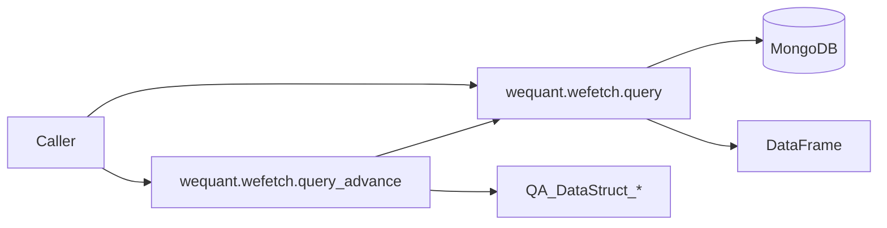

# Dataflow (Function Level)
## Part 1: Module-level (Mermaid)

## Part 2: Function-level Flows
- `fetch_*`:
  ???`code/start/end/frequence/collections`
  ???`pd.DataFrame` / list / scalar
  ?????? e2e + notebook ??
- `fetch_*_adv`:
  ????? `fetch_*` ??
  ???`QA_DataStruct_*`?`.data` ? DataFrame?
  ?????? e2e + notebook ??

## Part 3: Minimal Interfaces
- DB: MongoDB collections (? QUANTAXIS ??)
- Library: `wequant.wefetch.query` / `wequant.wefetch.query_advance`
- Consumer: WEFetch API / notebook / e2e tests

## Evidence
- ? `05_ACCEPTANCE_EVIDENCE.md`
