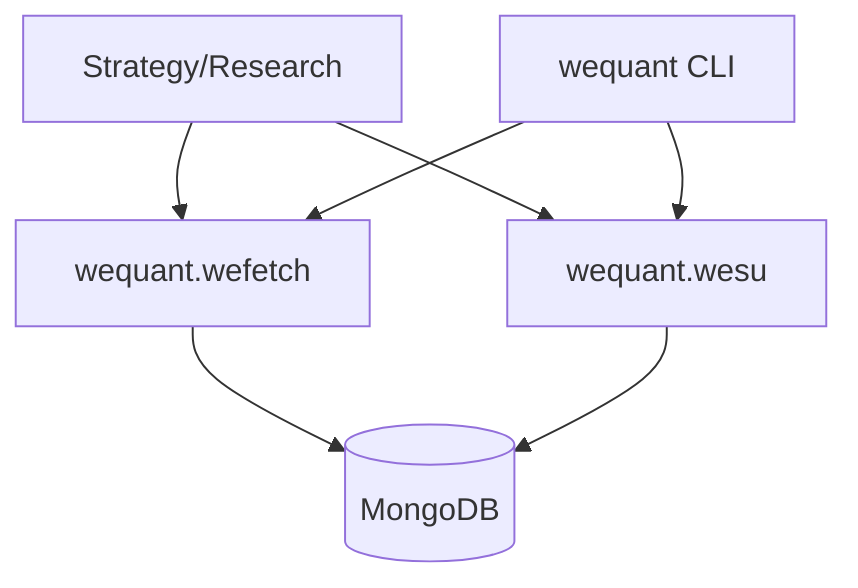

# 06_DATAFLOW_FUNCTION_LEVEL
## Part 1 - Module-level (mermaid)


## Part 2 - Function-level flows
WEFetch:
- `fetch_stock_day(codes,start,end)`:
  - input: codes + date range
  - query: `stock_day` by `date_stamp` or `date`
  - output: DataFrame with `volume=vol`, index `date`
- `fetch_future_day(codes,start,end)`:
  - input: codes + date range
  - query: `future_day`
  - output: DataFrame with `trade` and index `date`
- `fetch_etf_day(codes,start,end)`:
  - input: ETF codes
  - query: `stock_day` (default) or `etf_day`
  - output: DataFrame aligned with stock day schema
- `fetch_stock_adj(codes,start,end)`:
  - query: `stock_adj`
  - output: DataFrame indexed by `date`
- `fetch_*_list()`:
  - query: list collections
  - output: DataFrame indexed by `code`

WESU:
- `save_stock_day(df)`:
  - normalize `code`, `date`, `date_stamp`, `vol`
  - bulk upsert to `stock_day`
- `save_future_day(df)`:
  - normalize `date`, `date_stamp`, `trade`
  - bulk upsert to `future_day`
- `save_etf_day(df)`:
  - writes to `stock_day` (default) or `etf_day`
- `save_stock_adj(df)`:
  - normalize `code`, `date`
  - bulk upsert to `stock_adj`

## Part 3 - Minimal pairing table
| DB | Job | Library | Consumer |
|---|---|---|---|
| MongoDB | wequant CLI / pytest e2e | wequant.wefetch / wequant.wesu | notebooks / strategy |

## Evidence (run-backed)
Command:
```
conda run -n wequant wequant smoke-fetch --type stock --code 000001 --start 2024-01-01 --end 2024-01-31
```
Output (excerpt):
```
rows=22
```
